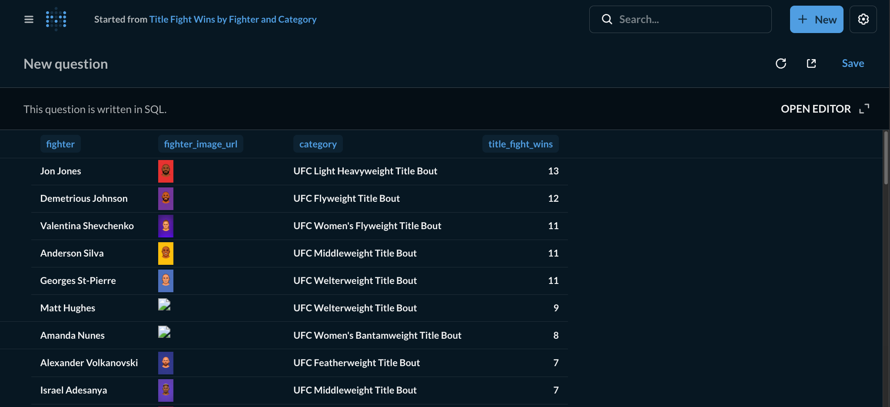

# UFC data warehouse


## What's in here?
This project loads fighters and fights stats, transforms and creates views for various stat lines.

# Stack
PostgreSQL, dbt, dlt, metabase


## Acknowledgements
This project uses a data set published by [https://github.com/Greco1899](https://github.com/Greco1899/scrape_ufc_stats).  
Many thanks to them for making this resource publicly available!


## Installation
Run the startup script from the repo root:
```bash
./startup.sh
```

## Visualizations
View the dashboards at 
```
http://localhost:3000/collection/root
username: reshefsharvit21@gmail.com
password: password1!
```

## Screenshot
<small>Table showing title fight wins by fighter and category.</small>

